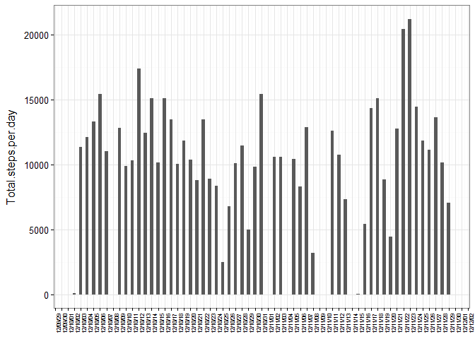
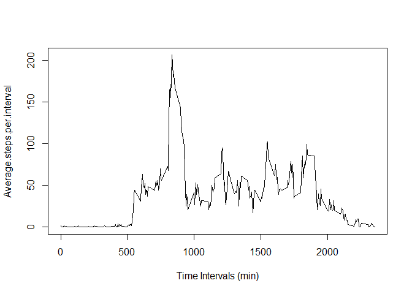
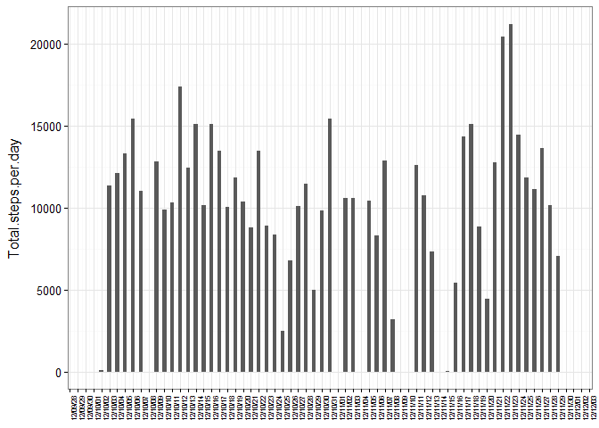
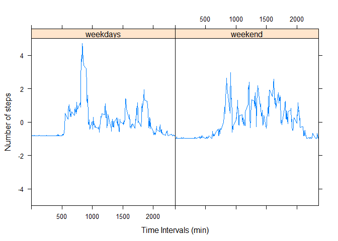

Loading and preprocessing the data
----------------------------------

Read data using read.csv() function

``` r
activity = read.csv("activity.csv")
```

Removing NA values

``` r
activity.1 = activity[!is.na(activity$steps),]
```

What is mean total number of steps taken per day?
-------------------------------------------------

Calculating the mean total number of steps taken per day

``` r
library(plyr)
library(ggplot2)
library(scales)

activity.2 = ddply(activity.1, 
                   "date", 
                   summarize, 
                   Total.steps.per.day = sum(steps))

activity.2$date = as.Date(activity.2$date)
  
ggplot(data = activity.2) +
  aes(x = date, y = Total.steps.per.day) +
  geom_bar(stat = "identity", width = .5) +
  scale_x_date(date_breaks = "1 day", date_labels = "%y/%m/%d") +
  theme_bw() + theme(axis.title.x = element_blank(),
                     axis.title.y = element_text(margin=margin(0,10,0,0)),
                     axis.text.x = element_text(angle = 90, size = 6))
```



Mean of total number of steps per day

``` r
round(mean(activity.2$Total.steps.per.day))
```

    ## [1] 10766

Median of total number of steps per day

``` r
round(median(activity.2$Total.steps.per.day))
```

    ## [1] 10765

What is the average daily activity pattern?
-------------------------------------------

Calculating average daily activity pattern

``` r
activity.3 = ddply(activity.1, 
                   "interval", 
                   summarize, 
                   Average.steps.per.interval = round(mean(steps)))

plot(activity.3$interval,
     activity.3$Average.steps.per.interval,
     type = "l",
     ylab = "Average.steps.per.interval",
     xlab = "Time Intervals (min)")
```



Interval that contains the maximum number of steps on average across all days

``` r
activity.3[which.max(activity.3$Average.steps.per.interval),1]
```

    ## [1] 835

Imputing missing values
-----------------------

Total number of rows with NAs

``` r
sum(is.na(activity$steps))
```

    ## [1] 2304

Performing the same calculations using directly the original activity dataset instead of the activity.1 dataset, which does not contain NAs.

The sum() and mean() functions have the na.rm set to be TRUE.

Calculating the mean total number of steps taken per day (activity dataset instead of activity.1)

``` r
library(plyr)

activity.4 = ddply(activity, 
                   "date", 
                   summarize, 
                   Total.steps.per.day = sum(steps, na.rm = TRUE))

activity.4$date = as.Date(activity.4$date)

library(ggplot2)
library(scales)

ggplot(data = activity.4) +
  aes(x = date, y = Total.steps.per.day) +
  geom_bar(stat = "identity", width = .5) +
  scale_x_date(date_breaks = "1 day", date_labels = "%y/%m/%d") +
  theme_bw() + theme(axis.title.x = element_blank(),
                     axis.title.y = element_text(margin=margin(0,10,0,0)),
                     axis.text.x = element_text(angle = 90, size = 6))
```



Mean of total number of steps per day (activity dataset instead of activity.1)

``` r
round(mean(activity.4$Total.steps.per.day))
```

    ## [1] 9354

Median of total number of steps per day (activity dataset instead of activity.1)

``` r
round(median(activity.4$Total.steps.per.day))
```

    ## [1] 10395

Two days, 12/09/28 and 12/12/03, that contain NAs are added to the measurements.

Since they contain only NAs, no steps where measured for these days.

The mean and median are reduced as a result of increasing the number of days.

Are there differences in activity patterns between weekdays and weekends?
-------------------------------------------------------------------------

Factor variable in the dataset with two levels – “weekday” and “weekend”

``` r
library(chron)
```

    ## Warning: package 'chron' was built under R version 3.3.1

``` r
days = c()
for (i in seq(nrow(activity.1))){
  d = as.Date(activity.1$date[i])
  if (chron::is.weekend(d)){
    days = c(days, "weekend")
  } else {
    days = c(days, "weekday")
  }
}

activity.1$days = days

head(activity.1,1)
```

    ##     steps       date interval    days
    ## 289     0 2012-10-02        0 weekday

Panel plot:

Separate data for weekdays and weekend

``` r
# for weekdays

activity_weekdays = ddply(subset(activity.1,
                                 days == "weekday"), 
                   "interval", 
                   summarize, 
                   Average.steps.per.interval = round(mean(steps)))

# for weekend

activity_weekend = ddply(subset(activity.1,
                                 days == "weekend"), 
                   "interval", 
                   summarize, 
                   Average.steps.per.interval = round(mean(steps)))
```

Normalize steps measurements

``` r
# for weekdays

Normalized = scale(activity_weekdays$Average.steps.per.interval)
days.2 = rep("weekdays", nrow(activity_weekdays))
activity_weekdays = cbind(activity_weekdays$interval,Normalized, days.2)

# for weekend

Normalized = scale(activity_weekend$Average.steps.per.interval)
days.2 = rep("weekend", nrow(activity_weekend))
activity_weekend = cbind(activity_weekend$interval, Normalized, days.2)
```

rbind data for weekdays and weekend

``` r
activity.6 = rbind(activity_weekdays,activity_weekend)
colnames(activity.6) = c("interval", "Normalized", "days.2")
activity.6 = as.data.frame(activity.6) 
```

Draw panel plot using lattice package

``` r
library(lattice)

xyplot(as.numeric(as.character(Normalized))~as.integer(as.character(interval)) | days.2, 
       data = activity.6,
       ylim = c(-5,5),
       type = "l", 
       xlim = c(0,2355),
       ylab = "Number of steps",
       xlab = "Time Intervals (min)")
```


